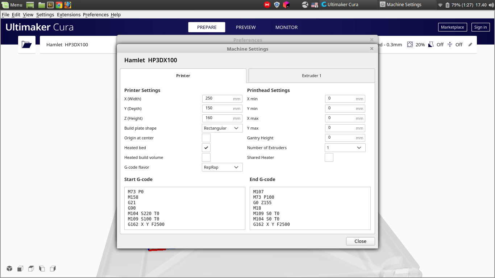
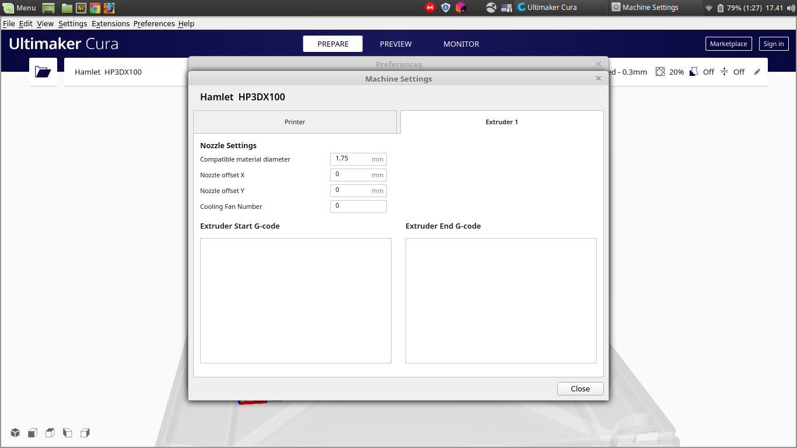
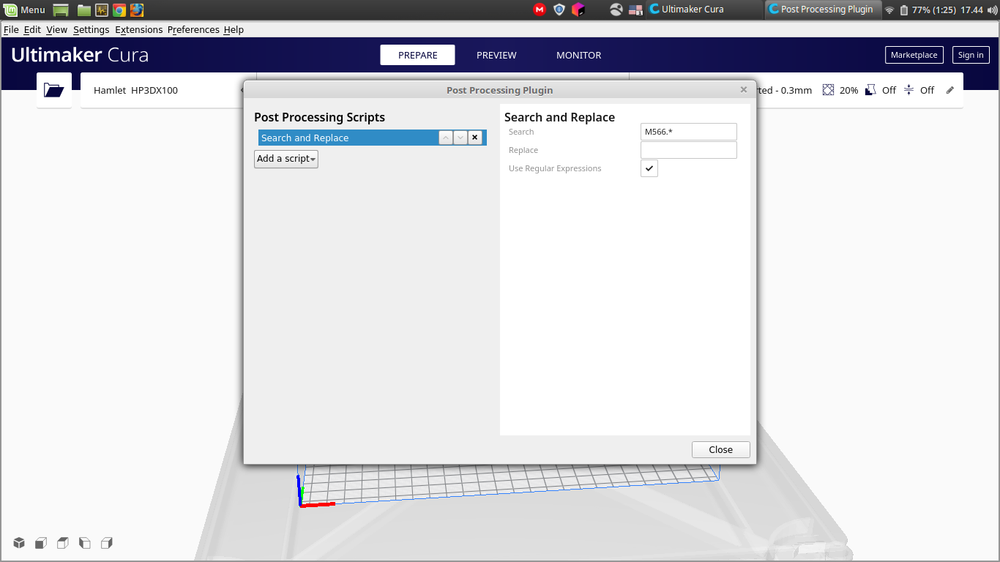
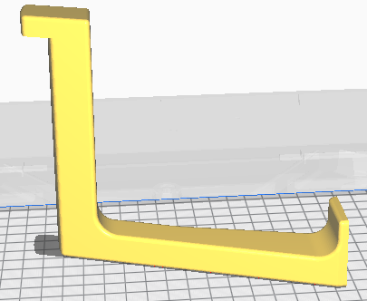
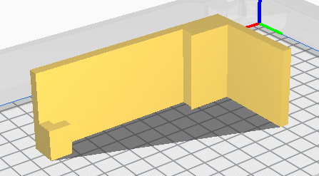
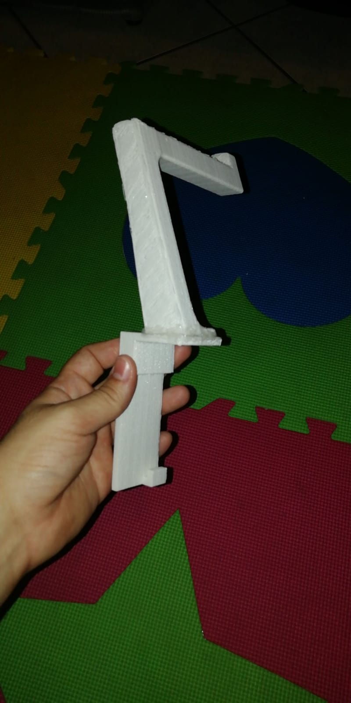
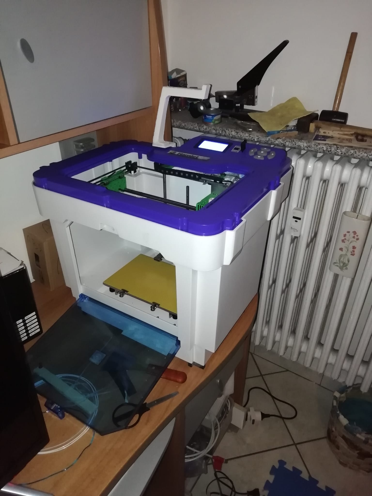
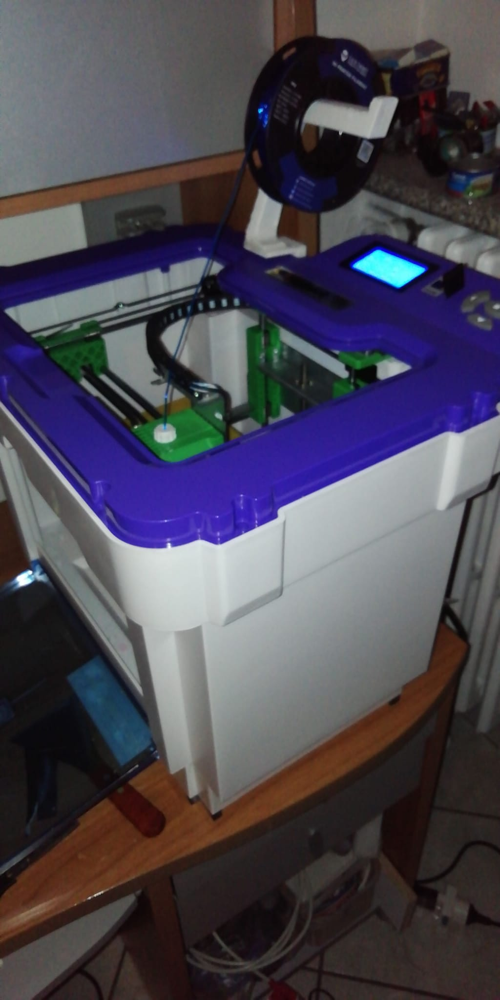

# hamlet_HP3DX100_configs
In this repository I put Cura and other slicers configs for hamlet 3D printer HP3DX100. 
In order to use TPU material or with spools different from the original one I create also a Spool Holder and I put there the files.


# Slicers
This part is the result of [this topic](https://community.ultimaker.com/topic/33298-cura-all-layer-start-from-the-corner/?tab=comments#comment-268335).

## Old cura settings
Using te [old CURA version 13.06.4](https://github.com/Ultimaker/Cura/releases/tag/13.06.4) compiled by myself i create the standard configuration using [official instructions](http://www.hamletcom.com/media/67174/cura_setup.zip):
* Generated file path: 'old_CURA-13.06.4_printer_config/hamlet.ini'
* it is iportable as printer profile

## Cura 4.6.2 settings
Start from the old version I create the new version configurations:
* Starting from Ultimaker printer config I modify as in figures

<table border="0">
 <tr>
  <td>
    
  </td>
  <td>
    
  </td>
  </tr>
    <tr>
     <td>
      <p style="text-align: center">Printer settings</p>
     </td>
     <td>
      <p style="text-align: center">Printer settings Nozel</p>
     </td>
    </tr>
</table>

* start gcode path: 'CURA-4.6.2_printer_and_materials_config/start_gcode.txt'
* end gcode path: 'CURA-4.6.2_printer_and_materials_config/end_gcode.txt'
* materials settings path
  * ABS: 'CURA-4.6.2_printer_and_materials_config/ABS.xml.fdm_material'
  * PLA: 'CURA-4.6.2_printer_and_materials_config/PLA.xml.fdm_material'
  * TPU: 'CURA-4.6.2_printer_and_materials_config/TPU.xml.fdm_material'
* printing profiles path:
  * ABS: 'CURA-4.6.2_printer_and_materials_config/ABS.curaprofile'
  * PLA: 'CURA-4.6.2_printer_and_materials_config/PLA.curaprofile'
  * TPU: 'CURA-4.6.2_printer_and_materials_config/TPU.curaprofile'
* Also at "Extensions>Post Processing>Modify G-Code" add ```M566.*``` and check "Use Regular Expressions" 



## Simplify3D
In [this topic](https://www.stampa3d-forum.it/forum/topic/567-adattare-la-mia-hamlet/) I found a Simplify3D settings for Hamlet HP3DX100, and I store it at path 'Simplify3D/3dx100_v2.fff' because someties the post files disappear.

# Spool Holder
To print TPU I create a new spool holder, starting from [this project](https://www.thingiverse.com/thing:2171625) and I create two pieces that I glued with hot glue. The file are in paths:

* 'TPU_Spool_Holder/base.stl'
* 'TPU_Spool_Holder/hand.stl'

<table border="0">
 <tr>
  <td>
    
  </td>
  <td>
    
  </td>
  <td>
    
  </td>
 </tr>
 <td>
    
  </td>
  <td>
    
  </td>
  <td>
    
  </td>
 </tr>

</table>

I upload also [here](https://www.thingiverse.com/thing:4556745).

